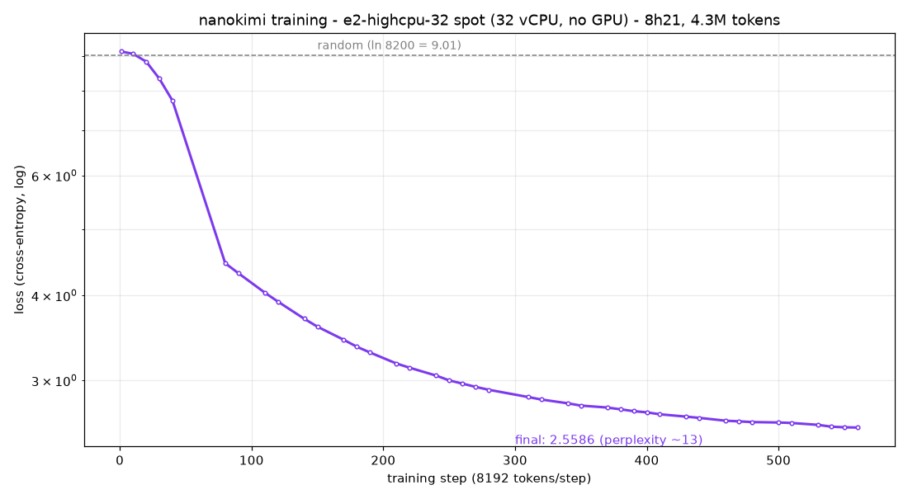

# microkimi

**Run and train your own miniature Kimi K3: a zero-dependency Rust inference engine, reimplemented from scratch - and nanokimi, a small model trained from scratch on CPU by the included training pipeline. No GPU needed.**

> *The moon loved the sun, but they could never meet,*
> *so every night, they would go to the park to play.*
> *Every night, the moon danced with the stars,*
> *and they were very happy, playing together every day.*
> *The end.*
>
> - microkimi

Two things live in this repository:

- **microkimi** - a **zero-dependency Rust inference engine for the Kimi K3
  architecture**: KDA (Kimi Delta Attention), MLA NoPE, latent MoE with 896
  routed experts top-16 + 2 shared, SiTU activations, AttnRes block residuals,
  MXFP4-packed experts. Verified **1:1 against Moonshot's official reference
  code** (fp32, bit-level routing parity).
- **nanokimi** - a small K3-architecture **model trained from scratch**:
  random weights in, coherent English stories out, produced by the included
  `nano/` pipeline in one night on a single CPU cloud VM (no GPU). Same
  architecture as K3, smaller dimensions, and the same Rust engine serves it.

Pure `std` Rust: no crates, no BLAS, no CUDA. Multithreading is
`std::thread` + a persistent pool; HTTP is a `curl` shellout.

## Run it in 30 seconds

You need nothing but a Rust toolchain (`rustup`) - no dependencies to install.

```bash
cargo build --release
# download nanokimi.bin + vocab_nano.json from the GitHub Releases page
# into the repo root, then:
./target/release/microkimi run "Once upon a time, a kind dragon lived in a cave. Every morning, he" \
  --model nanokimi.bin --max-new 12 --raw
# answer:  would go to the park and play with his friends.

./target/release/microkimi chat --model nanokimi.bin --raw      # interactive stories
./target/release/microkimi run "One day, a cat found a ball." \
  --model nanokimi.bin --max-new 10 --raw --debug-routing       # watch the MoE router pick experts
```

**Highlights**

- ~3,000 lines of dependency-free Rust implementing the full K3 forward pass:
  KDA recurrence, MLA, latent MoE, MXFP4 kernels, tiktoken BPE, custom
  checkpoint format. No crates, no BLAS, no CUDA.
- **Bit-level parity with Moonshot's official modeling code**: router top-16
  exactly identical, final logits within 6e-5, layer-by-layer proof included.
- **nanokimi**: from random weights to coherent English stories in one night
  on a 32-vCPU preemptible VM, no GPU - then served by the same Rust engine at
  134 tok/s on a laptop.
- Reproducible end to end: deterministic builds, golden-tested mechanisms,
  atomic checkpoints, preemptible-proof watchdog.

## What it is / What it is not

- **Independent project. No affiliation with Moonshot AI** (or
  Alibaba/Qwen, Hugging Face, or the fla-org team). "microkimi" is a
  re-implementation of the *architecture* described in Kimi K3's open
  checkpoint config and reference modeling code.
- **No weights in this repository.** `microkimi build` assembles a
  micro-scale checkpoint (~2.5 GB, 93 layers) from: small tensors and 3 real
  experts fetched from `moonshotai/Kimi-K3` via HTTP range requests,
  embedding/lm_head rows from `Qwen/Qwen2.5-0.5B-Instruct` (Apache 2.0), and
  seeded random sampling from those real-value pools. Output is deterministic
  gibberish by design - the point is the engine, not the weights.
- Moonshot's reference Python files and `tiktoken.model` are **downloaded at
  runtime, never vendored** (separate Moonshot license).
- nanokimi produces a *trainable* small config (8-12 layers, 8 192-token
  remapped vocab of the real Kimi tokenizer) that you train yourself on
  TinyStories. The output is real (simple) English - see below.
- **CPU only, for now.** The engine is pure portable `std` Rust with no
  platform-specific code. GPU execution would just mean porting the matvec
  kernels; the model, formats and pipeline are unchanged.

## The architecture (micro vs real K3)

**microkimi is the Kimi K3 architecture, unchanged.** The only differences are
tensor dimensions, chosen so the model fits in workstation RAM: hidden size
7168 → 512, KDA heads 96 → 4, MLA heads 96 → 4, expert hidden 3584 → 128,
expert intermediate 3072 → 64, dense MLP intermediate 33792 → 2048. Everything
else is identical to Kimi K3: the layer count and KDA/MLA split, the 896
routed experts with top-16 + 2 shared, the AttnRes block size, the vocabulary
and tokenizer, and every single mechanism.

The mechanisms come from a frontier architecture, implemented exactly:

- **KDA (Kimi Delta Attention)** - a linear-attention recurrence with
  per-channel learned decay and a delta-rule update; its fixed-size state is
  what makes million-token contexts feasible without a growing KV cache.
- **MLA (Multi-head Latent Attention)** - compresses keys and values into a
  small shared latent, here with no positional encoding at all.
- **Fine-grained MoE** - 896 routed experts per layer (16 active per token,
  plus 2 shared), driven by a sigmoid router with a score-correction bias.
- **AttnRes** - residual blocks re-mixed by attention every 12 layers.
- **SiTU** activations.
- **MXFP4** expert storage, dequantized on the fly.

What is scaled down is the tensor dimensions (to fit in RAM) and the training
budget, not the architecture: given the real dims, data and GPU hours, this
same code path is built to run the same computation.

Tools with examples to train from scratch are included. **nanokimi** is a
demo model showing the full path end to end: random weights in, coherent
English stories out - see below.

| component | real K3 | microkimi | nanokimi |
|---|---|---|---|
| layers | 93 (69 KDA + 24 MLA) | **93 (same)** | 8-12 |
| hidden | 7168 | **512** | 512 |
| vocab | 163 840 | **163 840 (real tokenizer)** | 8 192 + 8 specials (remap) |
| KDA heads × dim | 96 × 128 | **4 × 128** | 4 × 128 |
| MLA (NoPE) heads | 96 | **4** (q_lora 128, kv_lora 64) | 4 |
| experts routed / top-k / shared | 896 / 16 / 2 | **896 / 16 / 2 (same)** | 896 / 16 / 2 |
| expert hidden / inter | 3584 / 3072 | **128 / 64** | 128 / 64 |
| AttnRes block size | 12 | **12** | 4 |
| expert storage | MXFP4 | **MXFP4 (dequant on the fly)** | MXFP4 |

Mechanisms implemented exactly: KDA (causal depthwise conv4 + SiLU, per-channel
log-decay gate bounded at -5, delta-rule recurrent state, gated RMSNorm), MLA
with latents and shared k_rot, sigmoid router with score-correction bias and
renormalization, latent down/norm/up around experts, SiTU(β=4, 25) everywhere,
AttnRes with RMS-scored residual blocks, MXFP4 (e2m1 + e8m0 per 32).

## Quickstart (full pipeline from source)

```bash
cargo build --release

# assemble microkimi.bin (~2.5 GB): fetches small K3 tensors + 3 experts via
# HTTP range requests, Qwen embeddings from the HF cache (or downloads them)
./target/release/microkimi build

# mechanism self-tests vs reference golden values (torch required once to
# regenerate ref/golden.json via ref/make_golden.py)
./target/release/microkimi selftest

# 1:1 parity vs Moonshot's official modeling code (see below)
python3 ref/parity_ref.py            # regenerates ref/parity_golden.json
./target/release/microkimi paritytest

# generate (deterministic gibberish - synthetic weights, real engine)
./target/release/microkimi run "The capital of France is" --max-new 12
./target/release/microkimi chat        # interactive, keeps history

# watch the router think
./target/release/microkimi run "Once upon a time" --debug-routing --max-new 8
```

## The 1:1 parity proof

`paritytest` drives Moonshot's **own** `KimiDecoderLayer` / `KimiDeltaAttention`
/ `KimiMLAAttention` / `KimiSparseMoeBlock` classes (downloaded at runtime,
fp32) layer by layer with micro dims and the *same* `microkimi.bin` weights,
then diffs against the Rust forward on a fixed sequence:

- **Router top-16 indices: EXACT match** at every probed MoE layer (1, 47, 92)
  and every position, across the full forward pass.
- Final logits: max_abs **5.8e-5** (f32 summation-order noise, torch BLAS vs
  hand-rolled dot); top-16 logit ids exact everywhere.
- Per-layer hidden states and layer-1 KDA / MoE-routed / MoE-shared sub-blocks:
  1e-9 … 3e-5.
- 4 mechanism goldens (KDA recurrence vs fla naive, SiTU, MXFP4 dequant,
  AttnRes) pass at 1e-4.

`paritytest --show` prints the concrete side-by-side values.

## nanokimi - a K3-architecture model, trained from scratch, overnight, on CPU

nanokimi answers the obvious question: **does this architecture actually
learn?** Starting from pure noise (seeded random weights), the `nano/` pipeline
trains a small K3-architecture model on TinyStories until it writes coherent
English stories. No GPU, no datacenter: one preemptible cloud VM, one night, a
few dollars.

### From noise to stories

Same engine, same greedy decoding, same prompt - only the weights change:

| model | weights | `"Once upon a time, there was a little girl named Lily."` |
|---|---|---|
| microkimi | synthetic, untrained | `增进食欲蚕食蚕食蚕食蚕食…` |
| nanokimi smoke | 200 steps (~0.1 M tokens) | `". She wanted to play with the toy, but the park was very happy."` - grammatical, but the *same sentence for every prompt* |
| **nanokimi** | **560 steps (4.3 M tokens)** | `" She loved to play with her toys and her favorite toy was a big, red ball. One day, Lily's mom asked her to help clean the park. Lily was so happy and excited to play with the ball."` |

The model follows the prompt (raw, unedited outputs):

- `"Tom was a small boy who loved to play outside."` → `" One day, he went to the park to play with his friends. They played together and had lots of fun."`
- `"One day, a cat named Whiskers found a shiny red ball."` → `" He wanted to play with it, but he was too small to play with it. He asked his friend, a little bird, to help him…"`
- `"One morning, a little fox named Ruby found a golden key in the forest."` → `" He was so happy and excited to play with it. He played with it all day long…"`

The router learned too: after training, expert usage is differentiated without
collapse (top expert ≈ 8 % of calls vs 0.06 expected if uniform), visible live
with `--debug-routing`.

### The training run



- **VM**: GCP e2-highcpu-32 spot (32 vCPU, 31 GB RAM, **no GPU**, ~$0.5/h).
- **Corpus**: TinyStories V2, tokenized with the real Kimi tiktoken vocabulary,
  remapped to the top 8 192 tokens (99.95 % coverage, BOS/EOS per story),
  150 M tokens prepared.
- **Model**: 181.6 M params - 8 layers (6 KDA + 2 MLA), 7 MoE layers × 896
  experts top-16 + 2 shared, AttnRes - only ~25 M active per token.
- **Recipe**: AdamW lr 3e-4 cosine, batch 32 × 256, fp32, gradient
  checkpointing, grouped-GEMM MoE (bit-exact vs the naive loop).
- **Result**: 560 steps, 4.3 M tokens, 501 minutes (~140 tok/s),
  **loss 9.13 → 2.5586** (perplexity ~8200 → ~13).
- **Survived**: one OOM (memory creep, found and fixed), one GCP preemption
  (userland watchdog + atomic checkpoints + `--resume`).

### Why it scales to the full dataset

- Only **3 % of the prepared corpus** was seen, and the loss was still
  descending when the cosine schedule ended. Nothing saturated; more steps =
  more learning.
- The full 150 M-token corpus is ~12 days on the same $0.5/h box, or ~1 day on
  12 boxes with data parallelism. The pipeline is already checkpoint/resume
  safe and preemptible-proof.
- The architecture is not the bottleneck: these are the exact K3 mechanisms
  (KDA, MLA, latent MoE), which Moonshot scales to 2.8 T params. The Rust
  engine is config-driven - the same binary runs nanokimi and the 93-layer
  microkimi with zero code change.
- TinyStories-class scaling is documented: models of this size reach coherent
  multi-sentence plots when trained on the full corpus.

### The pipeline

`nano/` is self-contained: `prepare.py` (remaps the real Kimi BPE to
the top-8192 tokens of the corpus - 99.95 % coverage), `model_nano.py` (drives
the same Moonshot classes in training mode; includes a differentiable
drop-in replacement for the inference-only Moonshot MoE block, and a
capacity-capped grouped-GEMM bmm), `train.py` (AdamW + cosine, atomic tmp+rename
checkpoints, `--resume`, RSS self-watchdog, gradient checkpointing), `export.py`
(quantizes experts to MXFP4, writes the same MKIM0002 format the Rust engine
reads), `ops/` (a userland watchdog + systemd user service that survives GCP
preemptible reboots and resumes from the last checkpoint).

## Measured performance

| workload | hardware | number |
|---|---|---|
| microkimi decode (93 layers, 2.5 GB f32+MXFP4) | 10-core ARM64 | **~59 ms/token** (~17 tok/s) |
| nanokimi decode (8 layers, 113 MB) | 10-core ARM64 | **~134 tok/s** |
| nanokimi training (batch 32×256) | 32 vCPU x86-64 | ~130-290 tok/s (shared CPU) |
| `microkimi build` (fetch + quant + write 2.5 GB) | 10-core ARM64 | ~65 s |

## Repository layout

```
src/            the Rust engine (13 modules, zero dependencies)
nano/           training pipeline (prepare / model / train / export / ops / eval)
nano/vendor/fla pure-PyTorch fla-core shim (MIT, © fla-org - see vendor/README.md)
ref/            test tooling: make_golden.py, parity_ref.py, fetch_moonshot.py
```

## License & acknowledgments

- This project: **MIT**, © 2026 Arnaud GRANAL (see `LICENSE`).
- Kimi K3 architecture and reference modeling/tokenizer code: **Moonshot AI**
  (separate license - files downloaded at runtime, never vendored). Thanks for
  open-sourcing the checkpoint and the reference implementation.
- `nano/vendor/fla`: semantics from **flash-linear-attention (fla-core)**, MIT,
  © Songlin Yang, Yu Zhang, Zhiyuan Li (pure-PyTorch port of fla-core
  semantics used by the vendored shim).
- Embeddings/projection value pools for `microkimi build`:
  **Qwen2.5-0.5B-Instruct** (Apache 2.0).
- TinyStories training data (Ronen Eldan, Microsoft Research).
